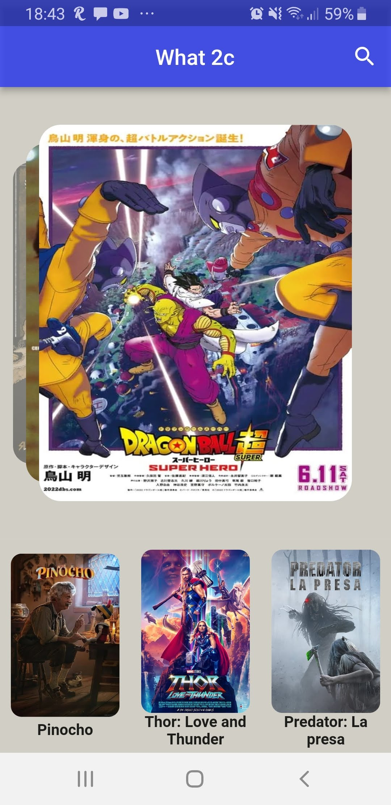
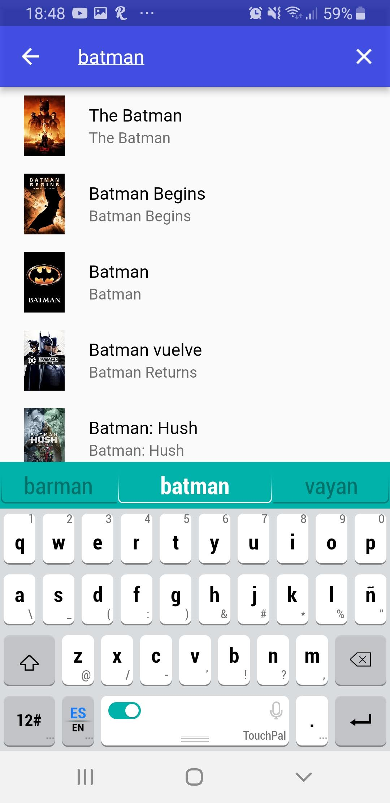

## - Movies

```
📌 A mobile aplication developed with Flutter

In this aplication I learn how to create a multiplataform app with the framework Flutter, using Provider as a state manager, I also learn how to
consume APIs from third parties.


🚀 Technologies:
Flutter - Provider 
```

<div display = "flex" justify-content = "center" >




</div>
